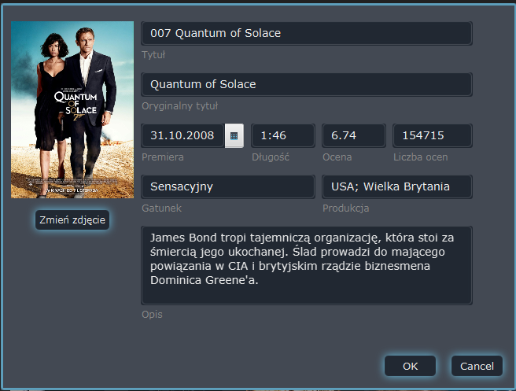
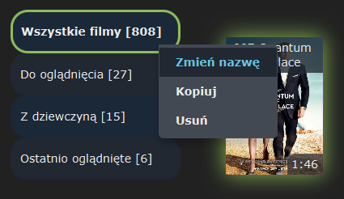
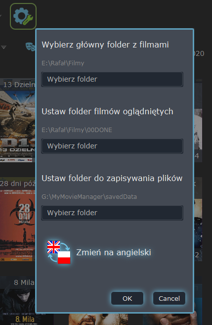
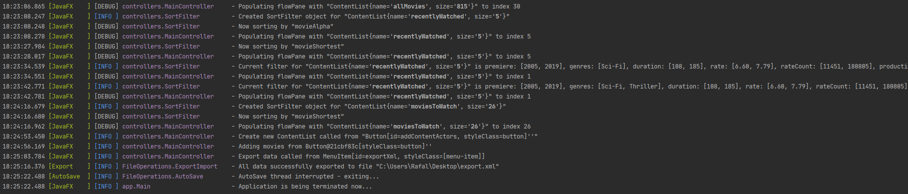

# MyMovieManager
### A video demo: https://youtu.be/CR4zDBWPwSY
#### MyMovieManager is desktop application to manage your personal film library. It can download movie data from internet movie data base - filmweb.pl in three ways. You can specify concrete movie file, choose a directory that will be recursively search for movie files or simply pass movie URL to filmweb. Beside movie info also data about directors, writers and actors will be downloaded. There is possibility to create own lists containing movies or actors.

#### When movie is chosen from file then the filmweb data base is being searched by file name. The algorithm is comparing given string with top results of made query and choosing the best one. Using regular expression movies and actors data are extracted from the web.   

#### Downloaded data are saved in .xml files. There is dedicated class 'AutoSave' to get all new or edited one data and pass them to save using XML parser. There is possibility to export all data to .zip or .xml file. Using such exported files you can import them on different PC.

## MyMovieManager overview:

The main window

Actor list

Movie detailed info window

Searching, sorting and filtering

Downloaded data are editable

Context menu

Add movie directly from web

Create new list 

Settings

Application has logging

A created file containing summary of recently downloaded movies

